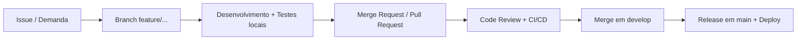

# Grupo Netway - Engenharia de Software, Dados e Automacao

<p align="center">
	<a href="#"></a>
	<a href="#"></a>
	<a href="#"></a>
	<a href="#"></a>
	<a href="#"></a>
</p>

> Infraestrutura solida + codigo limpo + automacao inteligente para acelerar resultados de negocio.

<p align="center">
	
	
</p>

---

## Sumario

- [Grupo Netway - Engenharia de Software, Dados e Automacao](#grupo-netway---engenharia-de-software-dados-e-automacao)
  - [Sumario](#sumario)
  - [Quem Somos](#quem-somos)
    - [Missao](#missao)
    - [Visao](#visao)
    - [Valores](#valores)
  - [Stack Oficial](#stack-oficial)
    - [Backend e Frontend](#backend-e-frontend)
    - [Dados e Banco](#dados-e-banco)
    - [DevOps, Plataformas e Ferramentas](#devops-plataformas-e-ferramentas)
    - [BI e Analytics](#bi-e-analytics)
  - [Ecossistema de Repositorios](#ecossistema-de-repositorios)
  - [Workflow de Desenvolvimento](#workflow-de-desenvolvimento)
  - [Definition of Done (DoD)](#definition-of-done-dod)
  - [Padroes de Codigo](#padroes-de-codigo)
  - [Onboarding de Desenvolvedores](#onboarding-de-desenvolvedores)
  - [Como Contribuir](#como-contribuir)
  - [Recursos e Referencias](#recursos-e-referencias)
  - [Time e Contato](#time-e-contato)
    - [Canais internos](#canais-internos)
    - [Responsaveis](#responsaveis)
  - [EN Version](#en-version)
    - [About](#about)
    - [Mission](#mission)
    - [Vision](#vision)
    - [Core Values](#core-values)

---

## Quem Somos

No **Grupo Netway**, conectamos tecnologia a operacao real, desenvolvendo solucoes digitais escalaveis para telecom e mercados de alta demanda.

### Missao

Conectar pessoas e organizacoes com solucoes digitais que **superam expectativas** e **eliminam barreiras**.

### Visao

Ser referencia em **engenharia de software, dados e automacao** no mercado de telecom e tecnologia.

### Valores

- Colaboracao radical e transparencia por padrao
- Responsabilidade com dados, seguranca e conformidade
- Aprendizado continuo com feedback honesto
- Autonomia com senso de dono

---

## Stack Oficial

### Backend e Frontend

<p>
	
	
	
	
	
	
</p>

### Dados e Banco

<p>
	
	
	
	
	
</p>

### DevOps, Plataformas e Ferramentas

<p>
	
	
	
	
	
	
	
</p>

### BI e Analytics

<p>
	
	
	
</p>

---

## Ecossistema de Repositorios

| Repositorio | Descricao |
| --- | --- |
| `app-web` | Portal web administrativo e operacional |
| `api-core` | API principal do ecossistema Grupo Netway |
| `infra` | Infraestrutura como codigo (Terraform / IaC) |
| `mobile` | Aplicativo mobile em React Native |
| `docs` | Documentacao central, padroes e playbooks |

> Regra de ouro: novo projeto = README claro + documentacao minima desde o dia 1.

---

## Workflow de Desenvolvimento


```mermaid
flowchart LR
	A[Issue / Demanda] --> B[Branch feature/...]
	B --> C[Desenvolvimento + Testes locais]
	C --> D[Merge Request / Pull Request]
	D --> E[Code Review + CI/CD]
	E --> F[Merge em develop]
	F --> G[Release em main + Deploy]
```

1. Criar branch a partir de `develop`.

```bash
git checkout develop
git pull origin develop
git checkout -b feature/minha-feature
```

2. Fazer commits usando Conventional Commits.

```text
feat(api): adiciona endpoint de contratos
fix(ui): corrige layout do dashboard financeiro
chore(ci): ajusta pipeline de testes e lint
```

3. Abrir MR/PR para `develop`, incluindo sempre:

- Contexto da mudanca
- Prints/logs (quando aplicavel)
- Passos para teste manual

4. CI/CD executa automaticamente:

- Lint
- Testes
- Build

5. Aprovacao e merge:

- Aprovado -> merge em `develop`
- Releases partem de `main` com versionamento semantico

---

## Definition of Done (DoD)

Uma tarefa e considerada finalizada quando:

- Codigo implementado e revisado
- Testes locais executados com sucesso
- Lint sem erros
- Documentacao minima atualizada (README/changelog)
- PR/MR aprovado por pelo menos 1 reviewer
- Sem regressao funcional identificada

---

## Padroes de Codigo

- Linguagem padrao: TypeScript
- Commits: Conventional Commits
- Branches: `feature/*`, `fix/*`, `chore/*`, `hotfix/*`
- Estilo: ESLint + Prettier (onde aplicavel)
- Principios: Clean Code, SOLID, simplicidade e legibilidade
- Logs e erros: sempre com contexto e rastreabilidade

---

## Onboarding de Desenvolvedores

```bash
# 1) Clonar repositorio
git clone git@github.com:Grupo-Netway/<repo>.git
cd <repo>

# 2) Instalar dependencias
npm install

# 3) Configurar variaveis de ambiente
cp .env.example .env

# 4) Subir ambiente local
npm run dev

# 5) Rodar testes
npm test
```

Se algo quebrar nesse fluxo, abra uma issue ou acione o canal do time.

---

## Como Contribuir

1. Abra uma issue com contexto claro
2. Crie branch a partir de `develop`
3. Desenvolva com foco em qualidade e simplicidade
4. Garanta testes/lint/build locais
5. Abra PR/MR com descricao objetiva
6. Aguarde review e ajuste feedbacks
7. Merge apos aprovacao

---

## Recursos e Referencias

- Wiki interna: http://kb.netway.inf.br/login
- Conventional Commits: https://www.conventionalcommits.org/
- Guia de Markdown: https://www.markdownguide.org/basic-syntax/

---

## Time e Contato

### Canais internos

- Microsoft Teams: #Departamento de Tecnologia
- E-mail: departamento.to@netway.inf.br

### Responsaveis

<table align="center">
	<tr>
		<td align="center" style="padding-right: 24px;">
			<a href="https://github.com/Alxdelira" target="_blank" rel="noopener noreferrer">
				
			</a>
			<div style="margin-top: 10px; border: 2px solid #0ea5e9; border-radius: 10px; padding: 6px 10px;">
				<a href="https://github.com/Alxdelira"><b>Alexandre Nogueira</b></a><br>
				Backend Engineer
			</div>
		</td>
		<td align="center" style="padding-left: 24px;">
			<a href="https://github.com/AminahMakhoul10" target="_blank" rel="noopener noreferrer">
				
			</a>
			<div style="margin-top: 10px; border: 2px solid #ec4899; border-radius: 10px; padding: 6px 10px;">
				<a href="https://github.com/AminahMakhoul10"><b>Aminah Makhoul</b></a><br>
				FullStack Engineer
			</div>
		</td>
	</tr>
</table>

---

## EN Version

### About

At Grupo Netway, we build scalable digital solutions that connect software engineering, data, and automation to real-world operations.

### Mission

Connect people and organizations through digital solutions that exceed expectations and remove barriers.

### Vision

Become a market reference in software engineering, data, and automation for telecom and technology sectors.

### Core Values

- Radical collaboration and transparency by default
- Data responsibility, security, and compliance
- Continuous learning and honest feedback
- Ownership mindset with autonomy

For onboarding and contribution, follow the same workflow sections above.

<p align="center">
	<b>Curte codigo limpo, automacao ate o limite e deploy sem drama?</b><br>
	Voce esta no lugar certo.
</p>
