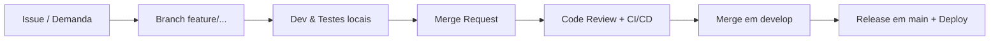

# 🚀 Grupo Netway – Time de Desenvolvimento

> 💡 Aqui é onde a infraestrutura do Grupo Netway encontra **código bem escrito**, **automação** e **dados em escala**.

<p align="center">
  <!-- Substitua por um gif/vídeo de demo interno se quiser -->
  
</p>

---

## ✨ Propósito e Cultura

**Missão**  
Conectar pessoas e organizações com soluções digitais que **superam expectativas** e **eliminam barreiras**.

**Visão**  
Ser referência em **engenharia de software, dados e automação** no mercado de telecom e tecnologia.

**Valores**  
- Colaboração radical e **transparência por padrão**  
- Responsabilidade com dados e segurança  
- Aprendizado contínuo + feedback honesto  
- Autonomia com senso de dono  

---

## 🛠️ Stack Oficial do Time

<p align="center">
  
  
  
  
  
  
</p>

<p align="center">
  
  
  
  
  
</p>

<p align="center">
  
  
  
  
  
</p>

<p align="center">
  
  
  
  
  
</p>

---

## 📂 Ecossistema de Repositórios

| Repositório | Descrição                                      |
|------------|------------------------------------------------|
| `app-web`  | Portal web administrativo e de operação         |
| `api-core` | API principal do ecossistema Grupo Netway       |
| `infra`    | Infraestrutura como código (Terraform / IaC)    |
| `mobile`   | App mobile em React Native                      |
| `docs`     | Documentação central, padrões e playbooks       |

> 📌 Regra de ouro: **novo projeto = README claro + docs mínimas desde o dia 1**.

---

## 🔄 Workflow de Desenvolvimento


1. Criar branch a partir de develop

```bash
git checkout develop
git pull origin develop
git checkout -b feature/minha-feature
```
2. Commits usando Conventional Commits
```text
feat(api): adiciona endpoint de contratos
fix(ui): corrige layout do dashboard financeiro
chore(ci): ajusta pipeline de testes e lint
```
3. Abrir MR/PR para develop

Incluir contexto da mudança

Prints/logs quando fizer sentido

Passos para teste manual

4. CI/CD

Lint, testes e build rodam automaticamente

5. Aprovação e merge

Aprovado → merge em develop

Releases gerenciadas a partir de main com versionamento semântico

👩‍💻 Onboarding de Devs
```bash
# 1. Clonar
git clone git@github.com:Grupo-Netway/<repo>.git
cd <repo>

# 2. Instalar dependências
npm install

# 3. Configurar variáveis de ambiente
cp .env.example .env

# 4. Subir ambiente local
npm run dev

# 5. Rodar testes
npm test
Se algo quebrar nesse fluxo, abra um issue ou fale no canal do time.
```
🧠 Recursos e Conhecimento
Wiki interna: http://kb.netway.inf.br/login

Padrão de commits: https://www.conventionalcommits.org/

Guia rápido de Markdown: https://www.markdownguide.org/basic-syntax/

👥 Time & Contato
Canais internos

Microsoft Teams: #Departamento de Tecnologia

E-mail: departamento.to@netway.inf.br

Responsáveis
Backend – [Alexandre Nogueira](https://github.com/Alxdelira)

FullStack – [Mateus de Moraes](https://github.com/MateussMoraes)

FullStack – [Aminah Makhoul](https://github.com/AminahMakhoul10)

Curte código limpo, automação até o limite e deploy sem drama? Você está no lugar certo.
